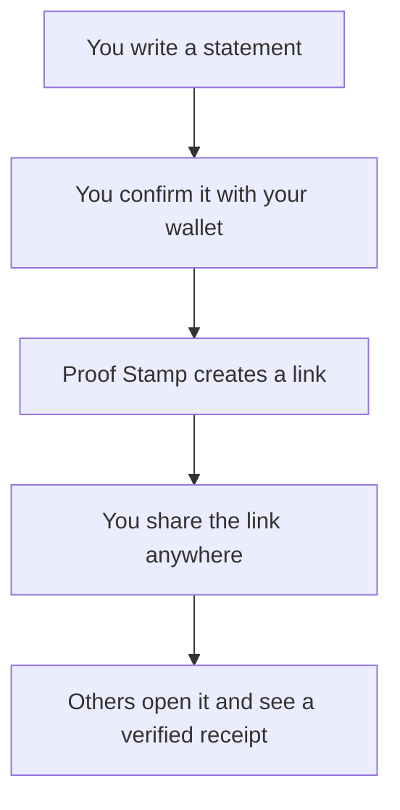

## Proof Stamp (miniapp)

_Proof Stamp_ lets you create a **tiny, tamper-proof receipt** for anything you want to state publicly.

You write a short message, your crypto wallet confirms “Yes, this really came from me,” and you get a link you can share anywhere.

Anyone who opens that link sees your message, the wallet that approved it, the exact time, and a **green checkmark** if everything is authentic.

They don’t need a wallet or any technical knowledge to view it.

Think of it like **digitally notarizing a sentence**—instantly, from your phone or laptop.

### How it works (simple view)

### Why you might use it

- **Public commitments**.
  Example: “I will release the new version next Tuesday.” A Proof Stamp adds a timestamp and authenticity so others know it wasn’t edited later.

- **Ownership proof in collaborations**.
  Example: A partner wants to confirm that you truly control a certain wallet before working with you.

- **Support or account recovery**.
  Example: A service asks you to prove you own an account without taking screenshots or sending sensitive information.

- **Reliable record-keeping**.
  Example: Saving an important statement with a verifiable date, just like bookmarking a receipt.

## Contributing

### Project setup

- Package manager: `pnpm` (v10+). Install deps with `pnpm install`.
- Dev server: `pnpm dev`
- Type-check + build: `pnpm build`
- Lint: `pnpm lint`
- Encoding benchmark: `pnpm run bench:encoding`

### Code guidelines

- Written in TypeScript + React; keep components focused and strongly typed.
- Reuse helpers in `src/hooks/urlEncoding.ts` for anything related to share-link formatting.
- Keep proof payloads `small and versioned` so old links never break.
- Use ASCII in source; comment only when something isn’t immediately clear.

### Pull request checklist

- [ ] `pnpm lint` and `pnpm build` both pass.
- [ ] Tests updated for any logic changes (especially encoding/decoding).
- [ ] Confirm that old and new share links still decode and validate.
- [ ] Update docs for any behavior or UI changes.
